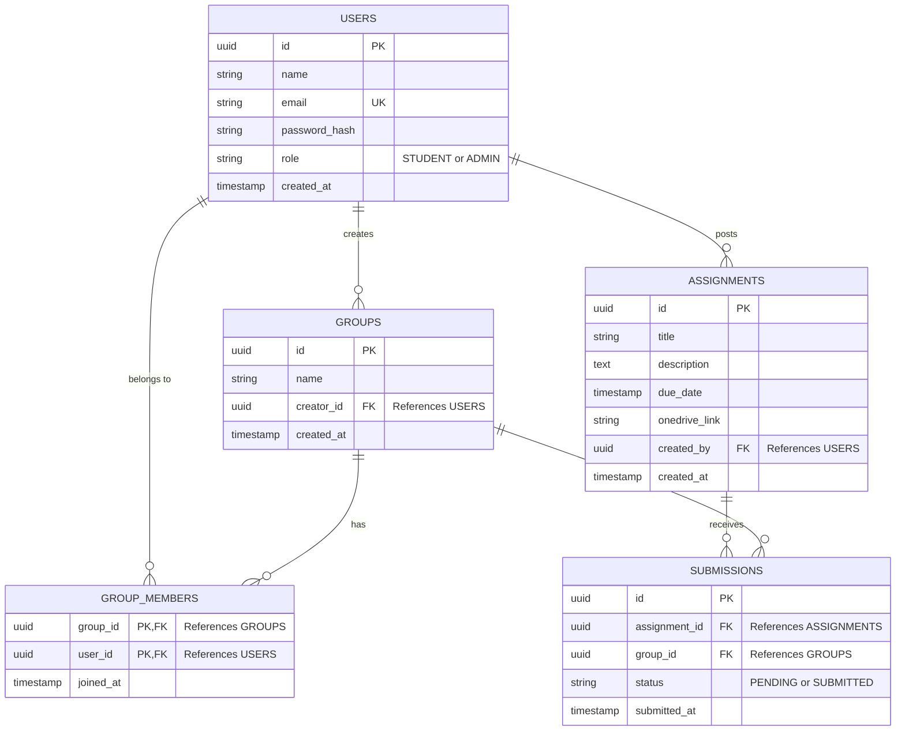

# Joineazy - Assignment Management System

## 📖 Overview of Implementation
Joineazy is a full-stack web application designed to streamline the assignment submission process between Professors (Admins) and Students. The application solves the problem of tracking group-based submissions by providing a unified platform where:
- **Professors** can post assignments, attach OneDrive submission links, and track which groups have successfully submitted their work in real-time.
- **Students** can register, form groups, manage their group members, and confirm their assignment submissions.

The UI is built with a premium, modern dark-themed glassmorphism aesthetic using React and Tailwind CSS. The backend uses a robust Express MVC architecture and PostgreSQL for relational data integrity.

---

## ⚙️ Setup & Run Instructions

### Prerequisites
- **Node.js** (v16+ recommended)
- **PostgreSQL** (v13+ recommended)

### 1. Database Setup
Ensure PostgreSQL is running locally, then create the database and user:
```bash
psql -U postgres
CREATE DATABASE joineazy;
CREATE USER joineazy_user WITH PASSWORD 'password';
GRANT ALL PRIVILEGES ON DATABASE joineazy TO joineazy_user;
```

### 2. Backend Setup
Navigate to the `server` directory and install dependencies:
```bash
cd server
npm install
```

Create a `.env` file in the `server` directory with the following variables:
```env
PORT=4000
DB_USER=joineazy_user
DB_HOST=127.0.0.1
DB_NAME=joineazy
DB_PASSWORD=password
DB_PORT=5432
JWT_SECRET=your_jwt_secret_key_here
```

Start the backend development server (this will automatically initialize the DB schema on the first run):
```bash
npm run dev
# Server will run on http://localhost:4000
```

### 3. Frontend Setup
Navigate to the `client` directory and install dependencies:
```bash
cd client
npm install
```

Start the Vite development server:
```bash
npm run dev
# Client will run on http://localhost:5173
```

---

## 🔌 API Endpoint Details

### Authentication (`/api/auth`)
- `POST /register` - Register a new user (Requires `name`, `email`, `password`, `role`).
- `POST /login` - Login and receive a JWT token.
- `GET /me` - Get the current authenticated user's profile.

### Assignments (`/api/assignments`)
- `POST /` - Create a new assignment (Admin only). Requires `title`, `due_date`, `onedrive_link`.
- `GET /` - Fetch all active assignments (Accessible to both Admins and Students).

### Groups (`/api/groups`)
- `POST /` - Create a new group (Student only).
- `POST /:id/members` - Add a member to a group by email (Student only).
- `GET /my-group` - Get the current student's group and its members (Student only).
- `GET /` - Fetch all groups and their members (Admin only).
- `DELETE /:id/members/:userId` - Remove a member or leave a group (Student only).

### Submissions (`/api/submissions`)
- `POST /:assignmentId/confirm` - Confirm that a group has submitted an assignment (Student only).
- `GET /` - Get all submission records for tracking (Admin only).

---

## 🗄️ Database Schema & Relationships



---

## 🏗️ Architecture Overview

The system follows a standard modern decoupled Client-Server architecture:

1. **Frontend (Client):** 
   - **React (Vite):** Handles the UI and component state.
   - **Tailwind CSS:** Manages the custom design system (tokens, glassmorphism, responsive grid layouts).
   - **Context API:** Manages global authentication state (`AuthContext`), keeping the UI in sync across Protected Routes.
   - **Axios:** Handles asynchronous API calls to the Express backend.

2. **Backend (Server):**
   - **Express.js:** Routes incoming HTTP requests to specific Controllers.
   - **MVC Pattern:** The logic is separated into Routes, Controllers, and Middleware (Auth gating).
   - **PostgreSQL (`pg` pool):** Raw SQL queries are used in controllers to maintain high performance and granular control over the data layer.

3. **Data Flow Example (Submitting an Assignment):**
   - *Student* clicks "Confirm Submission".
   - *React* triggers an Axios POST to `/api/submissions/:id/confirm` with the JWT in the Authorization header.
   - *Express Middleware* verifies the JWT and decodes the user ID.
   - *Submission Controller* queries Postgres to find the student's group, inserts a new record into `SUBMISSIONS`, and handles conflict resolution.
   - *Postgres* responds with the row, and Express sends a 200 OK back to the frontend, instantly updating the UI badge to "Submitted".

---

## 💡 Key Design & Deployment Decisions

1. **Relational Database Choice (PostgreSQL):**
   Chosen over NoSQL due to the strictly relational nature of the application (Users → Groups → Assignments → Submissions). Features like `JSON_AGG` allowed us to optimize complex queries (like fetching groups with all their members) into a single efficient database call.

2. **Unique Global Group Membership:**
   To enforce data integrity, the system applies a hard check preventing a student from joining or creating multiple groups. A student can only ever belong to one active group at a time.

3. **Premium UI Philosophy:**
   Standard generic UI frameworks were avoided in favor of a strictly customized Tailwind design system. By modifying `tailwind.config.js` and extracting custom utility classes (`.card`, `.btn-primary`), we ensured high visual consistency (dark aesthetics, glassmorphism) with zero code duplication.

4. **Security / Authentication Gating:**
   Both the frontend and backend enforce role-based access control (RBAC). The React `ProtectedRoute` instantly kicks users out if they try to access the wrong dashboard, while backend middleware (`requireRole`) ensures no rogue API calls can manipulate unauthorized data.

5. **Future Deployment Strategy:**
   - The application is decoupled, meaning the Vite build (`/dist`) can be statically hosted on Vercel or Netlify for lightning-fast edge delivery.
   - The Express backend can be deployed via Docker to platforms like Render, Railway, or AWS Elastic Beanstalk.
   - The PostgreSQL database should be hosted on a managed service (like Supabase or RDS) for automated backups and scaling.
